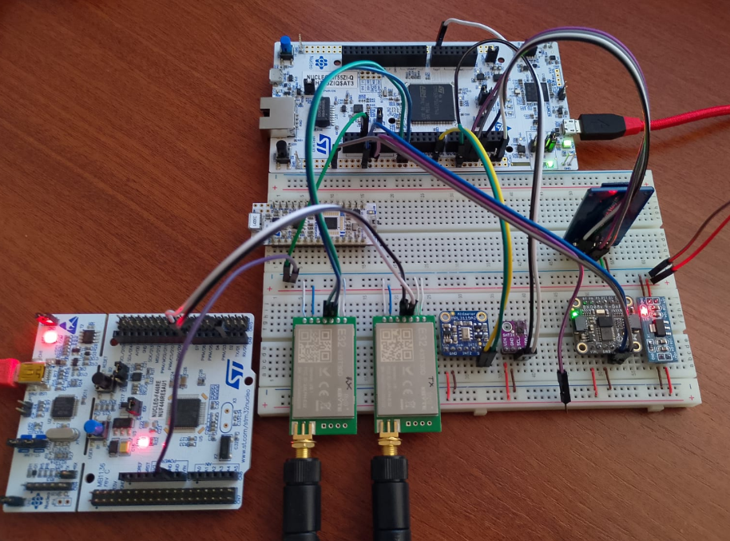

# Onboard Computer for an Experimental Rocket Designed by APU Space

  

  <em>OnBoard Computer breadboard prototype for testing and programming.</em>

## Overview
This repository contains the source code and documentation derived from preliminary tests conducted for the implementation of an OnBoard Computer (OBC) applied to an experimental rocket designed by APU Space.   
The project focuses on validating hardware, sensors, and communication systems prior to final deployment.
The system employs STM32 NUCLEO boards, specifically the NUCLEO-H755ZI dual-core board operating as the onboard computer inside the rocket, and the NUCLEO-F446RE board used as the ground station system.

## Methods

Communication with sensors and peripheral modules was implemented using standard digital communication protocols, including I2C, UART, and SPI. Initial configurations and functional tests of microcontrollers, sensors, and communication modules were first performed using Arduino and ESP32 development boards. Once proper operation was verified, the system was migrated to the STM32 platform. Firmware development and integration were carried out using STM32CubeIDE, targeting the dual-core H755ZI board. Wireless communication between the onboard computer (TX) and the ground station (RX) was implemented using EBYTE LoRa modules operating at 915 MHz. Sensor data acquired by the onboard computer is transmitted to the ground station and simultaneously stored on the SD card.

## System Description
The onboard computer integrates the following sensors, selected according to their respective datasheets:
- **SHT31**: measures ambient temperature and relative humidity
- **MPL3115A2**: provides atmospheric pressure and altitude estimation
- **BNO085**: supplies inertial measurement data, including orientation and motion sensing
- **SD Card Module**: enables onboard data logging and storage

## Results
The implemented system successfully enables:
- Acquisition of environmental and inertial sensor data
- Reliable wireless transmission of telemetry data to the ground station
- Local data storage for post-processing and validation

## Repository Structure
- `code/`: contains source code organized by development environment (Arduino, ESP32, STM32 NUCLEO)
- `datasheets/`: datasheets of sensors, microcontrollers, and communication modules
- `documentation/`: technical documentation describing the usage and configuration of sensors and microcontrollers
- `images/`: reference images related to the project
- `libraries/`: sensor and peripheral libraries
- `media/`: initial test data and experiments using the MPU6050 sensor
- `user_manuals/`: reviewed user manuals of STM32 NUCLEO boards

## Hardware Setup
The following hardware and tools were used during development and testing:
- STM32 NUCLEO-H755ZI (Onboard Computer)
- STM32 NUCLEO-F446RE (Ground Station)
- Arduino development boards
- ESP32 development boards
- Sensors: SHT31, MPL3115A2, BNO085
- SD Card module
- EBYTE LoRa communication modules (915 MHz)
- Laboratory power supply (12 V, 3 A)
- Digital multimeter

## Requirements
- **IDEs**:
  - STM32CubeIDE
  - Arduino IDE
- **Programming Languages**:
  - C
  - C++
- **Libraries**:
  - Sensor and module libraries used: `OBC/code/workspace_STM32/APU/CM4/Peripheral`

## Author
**David Fernando Evangelista Cuti** 
National University of Engineering (UNI), Peru
